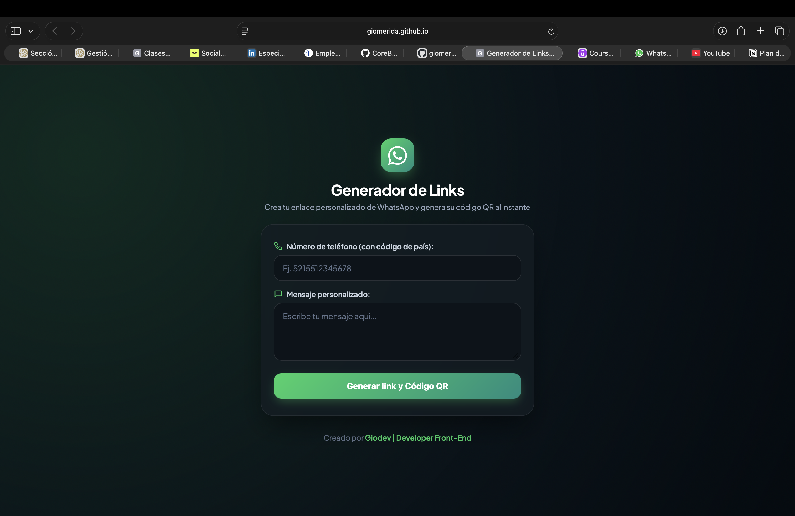

# 📲 Generador de Links de WhatsApp


Herramienta web sencilla y rápida para **generar enlaces directos de WhatsApp (`wa.me`)** con mensaje personalizado, junto con su **código QR** correspondiente para compartir o imprimir. Ideal para negocios, freelancers y cualquier persona que quiera facilitar el contacto por WhatsApp sin necesidad de guardar el número.

🔗 **Demo en vivo:** [https://giomerida.github.io/linkwhatsapp/](https://giomerida.github.io/linkwhatsapp/)

---

## 📋 Tabla de Contenidos

- [Características](#-características)
- [Capturas de pantalla](#-capturas-de-pantalla)
- [Tecnologías utilizadas](#-tecnologías-utilizadas)
- [Instalación y uso](#-instalación-y-uso)
- [Cómo funciona](#-cómo-funciona)
- [Casos de uso](#-casos-de-uso)
- [Estructura del proyecto](#-estructura-del-proyecto)
- [Roadmap](#-roadmap)
- [Autor](#-autor)

---

## ✨ Características

- 📱 **Generación instantánea** de enlaces `wa.me` con número y mensaje personalizados.
- 🔳 **Código QR automático** para compartir el enlace sin necesidad de escribirlo.
- 🌍 **Soporte para código de país** — compatible con cualquier número internacional.
- 💬 **Mensaje precargado** — el enlace abre WhatsApp con el texto ya escrito, listo para enviar.
- ⚡ **Sin backend ni registro** — 100% frontend, funciona directamente en el navegador.
- 📋 **Fácil de compartir** — copia el link o descarga el QR para usarlo en tarjetas, redes o sitios web.

---

## 📸 Capturas de pantalla

### 🏠 Formulario principal



### 🔳 Resultado con QR generado


---

## 🛠️ Tecnologías utilizadas

| Tecnología               | Uso                                                  |
| ------------------------ | ---------------------------------------------------- |
| **HTML5**                | Estructura del formulario                            |
| **CSS3**                 | Estilos y diseño responsivo                          |
| **JavaScript (Vanilla)** | Lógica de generación del link y validación de campos |
| **Librería QR (JS)**     | Generación del código QR a partir del enlace         |
| **GitHub Pages**         | Hosting y despliegue continuo                        |

---

## 🚀 Instalación y uso

Este proyecto no requiere instalación de dependencias. Solo clona el repositorio y abre el archivo principal en tu navegador.

### Clonar el repositorio

```bash
git clone https://github.com/giomerida/linkwhatsapp.git
cd linkwhatsapp
```

### Ejecutar localmente

```bash
# Con Python 3
python -m http.server 8080

# Con Node.js
npx serve .
```

Visita `http://localhost:8080` en tu navegador.

### Despliegue en GitHub Pages

El proyecto está listo para desplegarse directamente en GitHub Pages activando esta opción en la configuración del repositorio.

---

## ⚙️ Cómo funciona

1. Ingresa el **número de teléfono** incluyendo el **código de país** (ej. `521XXXXXXXXXX` para México).
2. Escribe el **mensaje personalizado** que quieres que aparezca precargado.
3. Presiona **"Generar link y Código QR"**.
4. El sistema genera automáticamente:
   - Un enlace directo tipo `https://wa.me/<numero>?text=<mensaje>`
   - Un **código QR** que apunta a ese mismo enlace.
5. Comparte el link o descarga/escanea el QR.

---

## 💼 Casos de uso

- 🛍️ Negocios que quieren facilitar el contacto directo por WhatsApp desde su sitio web o redes sociales.
- 🪪 Tarjetas de presentación físicas o digitales con QR de contacto directo.
- 📎 Firmas de correo electrónico con enlace rápido de WhatsApp.
- 🏪 Menús, flyers o anuncios impresos con QR para pedidos o consultas.
- 👤 Freelancers y profesionales que buscan simplificar su contacto sin publicar el número directamente.

---

## 📁 Estructura del proyecto

```
linkwhatsapp/
├── index.html          # Página principal con el formulario generador
├── css/                # Hojas de estilo
├── js/                 # (Sugerido) Lógica de generación de link y QR
└── README.md           # Este archivo
```

---

## 🗺️ Roadmap

- [ ] Botón de "Copiar enlace" con un clic
- [ ] Descarga directa del código QR en PNG
- [ ] Historial de enlaces generados (localStorage)
- [ ] Selector visual de código de país por bandera
- [ ] Vista previa del mensaje como burbuja de chat de WhatsApp
- [ ] Modo oscuro

---

## 👨‍💻 Autor

Desarrollado por **Giodev | Developer Front-End**

- 🌐 Sitio web: [giomerida.dev](https://www.giomerida.dev)
- 🐙 GitHub: [@giomerida](https://github.com/giomerida)

---

<div align="center">

© 2026 **Generador de Links de WhatsApp** — Herramienta gratuita creada por GioDev.

</div>
